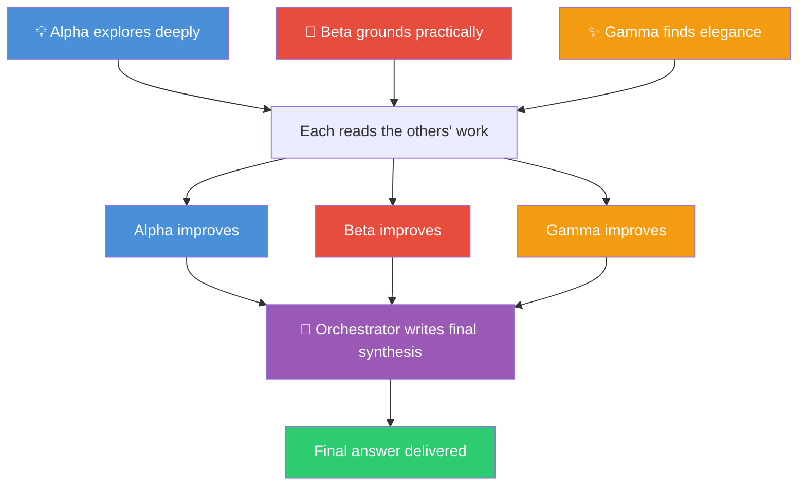
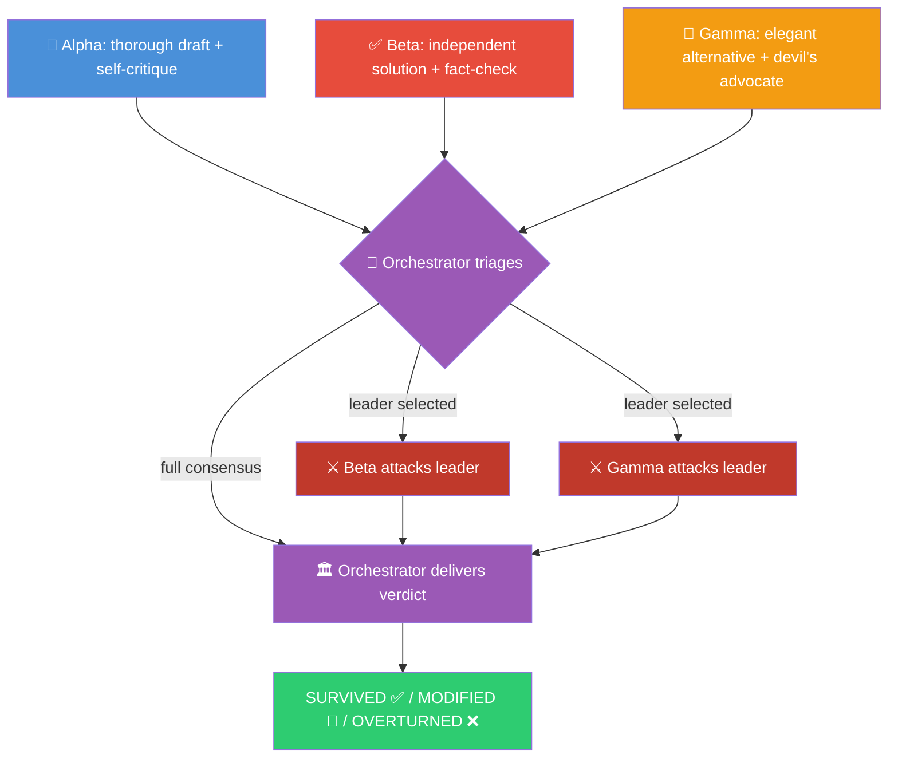

# Agent Council

A [Claude Code](https://docs.claude.com/en/docs/claude-code/overview) plugin that throws three Claude subagents at your problem in parallel. They either **build on each other's ideas** or **debate to stress-test the answer**, then an orchestrator delivers the final result.

Two modes, same foundation:
- **Collaborative** 🤝 (default): agents explore independently, read each other's work, improve their answers, then an orchestrator writes the best possible synthesis
- **Adversarial** 🗡️: agents draft independently, the orchestrator picks the strongest position, the others attack it, then a verdict is delivered

Fast enough for daily use on hard problems. Smart enough to **decline the council entirely** when the task is too simple to justify the overhead.

## An honest caveat up front

This plugin runs the council on **Claude models only** (Opus, Sonnet, Haiku). The original Copilot CLI version this was ported from mixed Claude + GPT + Gemini, and that cross-family diversity is more powerful. Different model families have different training data, different blind spots, and produce more distinct perspectives than the same model at different sizes.

A single-family council is **probably less effective than a cross-family council** at the thing this technique is best at (catching blind spots one model would miss). You should know that going in.

That said, this version is still useful because:

- **Tier diversity isn't nothing.** Opus, Sonnet, and Haiku behave noticeably differently. Opus explores deeper, Sonnet is more practical, Haiku gravitates toward minimal answers. The seats lean into those tendencies on purpose.
- **Distinct seat prompts dominate.** Most of the diversity in any council comes from *role* and *prompt framing*, not from the underlying model. Three Claudes told to behave very differently still disagree productively.
- **Mode-driven interaction adds value.** The "improve" round (collaborative) and the "attack" round (adversarial) force agents to take each other's positions seriously and rewrite or refute them. That procedural advantage is largely independent of model family.
- **Native Claude Code integration.** Subagents, parallel dispatch, and the `Agent` tool are first-class here. You get tighter context handling and faster wall-clock time than orchestrating cross-vendor calls from a CLI.

If you need real cross-family diversity, the [llm-council](https://github.com/karpathy/llm-council) project or a Copilot CLI / API / Opencode setup will serve you better. If you want a fast, deeply integrated, mode-driven council inside Claude Code, this plugin is the right fit.

## Why three seats at all?

Ask one model a question and you get one perspective. It'll sound confident even when it's wrong. It won't question its own assumptions. It definitely won't try to break its own argument.

Even within one family, three differently-prompted seats catch different things. Beta will challenge a version number Alpha asserted with HIGH confidence. Gamma will propose a simpler design that makes Alpha's elaborate one look like over-engineering. The **mode determines how they interact**:
- Collaborative: they steal each other's best ideas → novel synthesis
- Adversarial: they attack the strongest position → battle-tested answer

### The seats

| # | Codename | Collaborative Role | Adversarial Role | Subagent | Model |
|---|----------|--------------------|------------------|----------|-------|
| 1 | **Alpha** | Deep Explorer | Drafter & Red Teamer | `council-alpha` | opus |
| 2 | **Beta** | Practical Builder | Fact-Checker & Validator | `council-beta` | sonnet |
| 3 | **Gamma** | Elegant Minimalist | Optimizer & Devil's Advocate | `council-gamma` | haiku |
| 4 | **Orchestrator** | Author (writes final synthesis) | Judge (delivers verdict) | `council-orchestrator` | opus |

Each subagent is a separate file in `agents/` with its own system prompt that locks in the seat's persistent role. The skill injects only the per-phase task framing.

## How it works

### Collaborative Mode 🤝 (Default)



1. **Draft.** Alpha, Beta, and Gamma all explore the problem independently
2. **Improve.** Each agent reads the other two drafts and writes an improved version, stealing the best ideas
3. **Synthesize.** The orchestrator authors the definitive response from the three improved drafts

### Adversarial Mode 🗡️



1. **Draft.** Alpha, Beta, and Gamma all tackle the problem independently
2. **Triage.** The orchestrator uses a fixed rubric to identify the strongest position. If consensus, skip to verdict.
3. **Attack.** The other two agents try to tear apart the leading position
4. **Verdict.** The orchestrator decides: did the leader survive, need modification, or get overturned?

## Prerequisites

- [Claude Code](https://docs.claude.com/en/docs/claude-code/overview) installed and authenticated
- Access to Opus, Sonnet, and Haiku through your Claude Code plan (the council uses all three tiers)

## Install

### Local (during development)

```bash
git clone https://github.com/Sentry01/AgentCouncil.git
cd AgentCouncil
claude --plugin-dir .
```

The plugin is auto-discovered. No build step.

### Project-local (commit into your own repo)

Copy the plugin directory into your repo at `.claude/plugins/agent-council/`, or symlink it. Teammates get the council automatically when they run Claude Code in that repo.

### Global (install across all projects)

```bash
mkdir -p ~/.claude/skills/agent-council ~/.claude/agents ~/.claude/commands
cp skills/agent-council/SKILL.md ~/.claude/skills/agent-council/
cp agents/council-*.md ~/.claude/agents/
cp commands/council.md ~/.claude/commands/
```

You lose plugin namespacing but gain a single global install.

## Usage

### Mode detection

The council automatically detects which mode to use based on your language:

| You say… | Mode | Why |
|----------|------|-----|
| `council: How should we structure the API?` | 🤝 Collaborative | Default. Exploring a design space |
| `brainstorm: Novel approaches to caching` | 🤝 Collaborative | "brainstorm" = collaborative |
| `debate: Monorepo vs polyrepo` | 🗡️ Adversarial | "debate" = adversarial |
| `stress-test: Is this auth flow secure?` | 🗡️ Adversarial | "stress-test" = adversarial |
| `adversarial council: Should we use GraphQL?` | 🗡️ Adversarial | Explicit override |
| `collaborative council: Best testing strategy` | 🤝 Collaborative | Explicit override |

**Adversarial triggers:** debate, adversarial, challenge, stress-test, which is better, argue, attack, defend, versus, vs

**Collaborative triggers (default):** council, siege, swarm, brainstorm, multi-agent, collaborate, explore, build on, novel, creative, ideas

If both sets of trigger words appear, adversarial wins unless you use an explicit override like `collaborative council: …`.

### Complexity gate

The council **short-circuits** and answers directly when the task is too simple to justify 6–7 subagent calls.

Typical fast-path cases:
- arithmetic or obvious factual lookups
- one-line rewrites
- file lookups and command syntax
- narrow questions with one obvious path

Typical council-worthy cases:
- competing designs with meaningful tradeoffs
- security or correctness-sensitive review
- architecture and research synthesis
- ambiguous problems where multi-perspective synthesis can beat one model

### Slash command

```
/council Should we use a monorepo or polyrepo for our microservices?
```

```
/council debate Redis vs Memcached for our session store. Which survives at scale?
```

### Inside any Claude Code session

Trigger the skill by phrasing your prompt with a trigger word:

```
council: Should we use a monorepo or polyrepo for our microservices?
```

```
debate: Redis vs Memcached for our session store. Which survives at scale?
```

### Verbose mode

By default you only get the final answer. To see the reasoning flow:

```
verbose council: What caching strategy for a real-time dashboard?
```

Verbose mode shows a concise phase-by-phase view:
- 💡 Alpha / 🔨 Beta / ✨ Gamma drafts
- improved drafts or attack summaries
- final synthesis or verdict

If you want every draft in full, ask for **raw** or **full** council output explicitly.

## When to use each mode

### Collaborative 🤝: when you want novel ideas

- Brainstorming sessions and creative problem-solving
- Exploring a design space with no clear "right answer"
- Building something new where diverse perspectives help
- Research where breadth and synthesis matter

### Adversarial 🗡️: when you want battle-tested answers

- Architecture decisions you'll live with for years
- Security reviews (missed vulns are expensive)
- Comparing two specific approaches (A vs B)
- Anything where you need confidence the answer holds up under scrutiny

### Not worth it (either mode)

- Quick fixes, file lookups, simple questions
- Anything where speed matters more than depth
- Your model budget is tight (Opus calls aren't free)

## Cost & speed

| Mode | Subagent calls | Parallel rounds | Wall clock |
|------|----------------|-----------------|------------|
| Collaborative | 7 (3 + 3 + orchestrator) | 2 | ~2 rounds + synthesis |
| Adversarial | 4–6 (3 + 0–2 attackers + orchestrator) | 2 | ~2 rounds + verdict |

Both modes run seats in parallel within each phase. Wall-clock time is roughly two sequential subagent calls plus the final orchestrator step.

Two seats run on smaller tiers (Sonnet + Haiku), which keeps cost meaningfully lower than running three Opus calls.

For trivial tasks, the correct move is to skip the council entirely.

## Adapting to domains

Each seat shifts focus depending on what you're asking about:

| Domain | Alpha focuses on | Beta focuses on | Gamma focuses on |
|--------|------------------|-----------------|------------------|
| Code | Implementation + security self-review | API accuracy, versions, edge cases | Performance, readability, alternatives |
| Architecture | System design + failure modes | Tech claims, benchmarks, scalability | Simplicity, clarity, alternatives |
| Research | Comprehensive analysis + bias check | Source verification, citations | Actionability, counter-arguments |
| Writing | Content + tone self-critique | Factual accuracy, consistency | Flow, conciseness, formatting |

Domain precedence: **Code → Architecture → Writing → Research → General**.

Here, **Research** means investigation or literature-style evaluation, not code review.

## Example prompts

**Collaborative, brainstorming:**
```
council: Novel approaches to real-time collaboration in a document editor.
Think beyond CRDTs and OT.
```

**Collaborative, architecture:**
```
council: Design a notification system that scales to 1M users.
Push, pull, fan-out strategies.
```

**Adversarial, decision:**
```
debate: WebSockets + Redis pub/sub vs SSE + message queue for 10K concurrent users.
Cost, complexity, scaling, failure modes.
```

**Adversarial, security:**
```
verbose stress-test: Review this JWT implementation: [paste code]
```

**Adversarial, comparison:**
```
debate: PostgreSQL vs DynamoDB for a multi-tenant SaaS with unpredictable query patterns
```

## Project layout

```
.claude-plugin/plugin.json           Plugin manifest
skills/agent-council/SKILL.md        Main skill (triggers + protocol)
agents/council-alpha.md              Deep Explorer seat (opus)
agents/council-beta.md               Practical Builder seat (sonnet)
agents/council-gamma.md              Elegant Minimalist seat (haiku)
agents/council-orchestrator.md       Synthesizer / Judge (opus)
commands/council.md                  /council slash command
```

## Inspiration

Inspired by Andrej Karpathy's [llm-council](https://github.com/karpathy/llm-council), adapted as a Claude Code plugin with a dual-mode architecture.

This plugin is a port of the original **[Sentry01/AgentCouncil](https://github.com/Sentry01/AgentCouncil)** Copilot CLI extension. If you want the cross-family (Claude + GPT + Gemini) council, go use that one. It's the canonical multi-model version and where this design came from.

## License

MIT. Do whatever you want with it.
